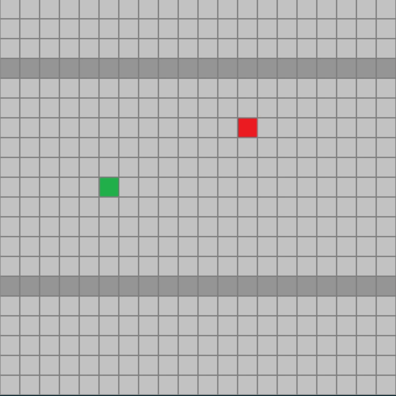
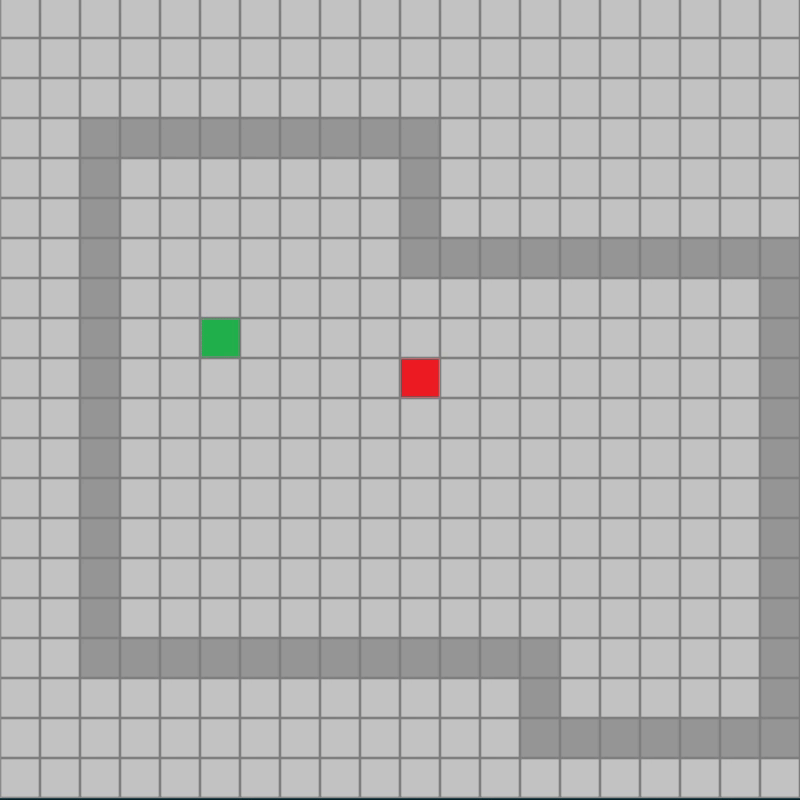
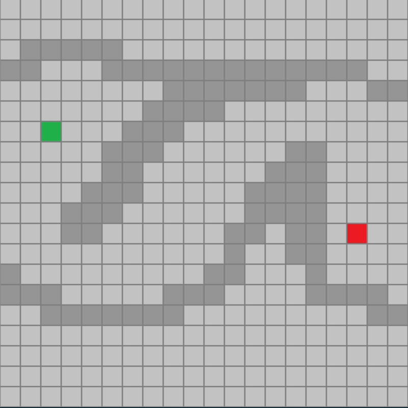
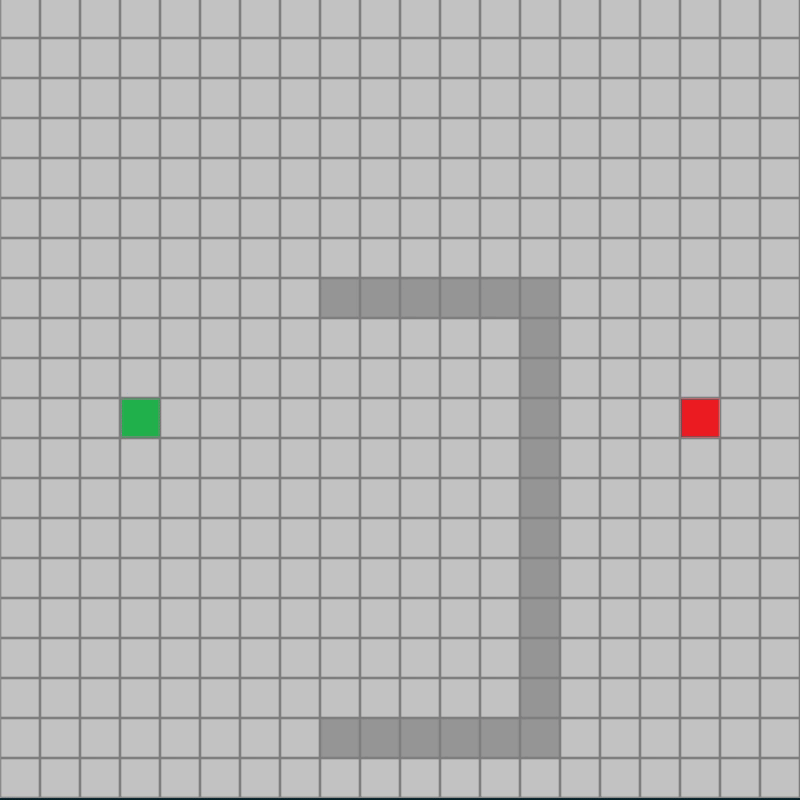
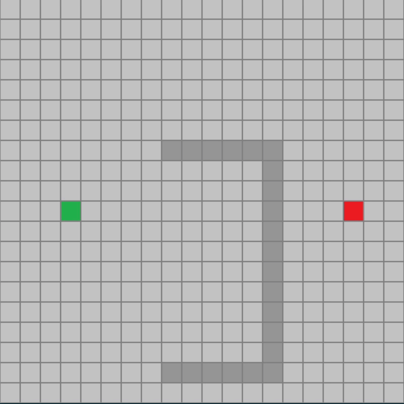

 

    

    
 
 
 
 

  
      
A simple visual approach to explaining pathfinding algorithms.  
Written in python and using pygame to implement graphical interface.  
Written by Jarett Sutula with the help of Professor Brian Gormanly of Marist College.  

## **Implementation**
Written throughout the 2021 Spring Semester, this project serves as a crucial visualization of various pathfinding algorithms that I have researched and written a thesis paper about. Pathfinding algorithms are harder to understand without some form of visualization, so this project serves to be a way for people interested in pathfinding algorithms to create their own grid with travel nodes and obstacles to better understand how our pathfinding algorithms search and draw paths.  
  
### **The 4 algorithms that this project is built around are:**
* Breadth First Search (BFS)
* Depth First Search (DFS)
* Dijsktra's Algorithm
* A* (A-Star)

### **Project Goals**
Week-by-week I will update these goals, add or remove goals, and highlight progress that has been made.
- [x] Create a basic grid system using pygame's graphical interface.
- [x] Allow the user to create start and end nodes on the grid that the algorithms will traverse between.
- [x] Allow the user to create obstacles on the grid that the algorithms have to traverse around.
- [x] Allow the user to clear the grid.
- [x] Implement BFS.
- [x] Implement DFS.
- [x] Implement Dijsktra's Algorithm.
- [x] Implement A*.
- [x] Allow the user to press a button to go step-by-step through the algorithm's process.
- [x] Add UI buttons to clear grid, change algorithms, etc.

  

 

# **Installation and How-To**
1. Clone the repo to your machine using `git clone https://github.com/JarettSutula/Pathfinding-Algorithms`
2. This application only requires pygame to run the interactive graphics. Use `pip install pygame` to install the latest version.
3. Once pygame is installed, just run main.py and enjoy!

### **Project Controls**
The interactable grid is 20x20. You can interact with it using...
* **Q** to place a start node (  ) where your cursor hovers
* **E** to place an end node (  ) where your cursor hovers
* **Left Mouse** to draw an obstacle node (  ). You can click and drag to place multiple.
* **Right Mouse** to erase obstacle, start, and end nodes. You can click and drag to erase multiple.
* There are buttons on the side of the grid to clear the entire grid, select a different algorithm, or check/uncheck various run options.

# **Project Showcase**  
### **Breadth First Search** 
BFS, or Breadth First Search, begins its approach at the start node (  ) and searches its immediate unvisited neighbors (  ). When a node is visited, it changes color (  ) and then adds its immediate unvisited neighbors to the queue. BFS goes until it either has no more unvisited neighbors or until it hits the end node (  ).

    

   Figure 1: BFS in action finding the end node.

### **Depth First Search** 
DFS, or Depth first Search, begins its approach at the start node. This time, however, it follows a stack-based approach, meaning it will go as far in one direction as it can before trying unvisited neighbors. In this case on a grid, DFS prioritizes North > East > South > West.

    

  Figure 2: DFS following direction priority until it finds the end node.

### **Dijkstra's Algorithm** 
DA, or Dijkstra's Algorithm weighs the cost of each node and takes the path of least cost. In a grid-based approach like this app, to keep things simple the cost of each node is 1, meaning that DA will act like BFS. Each node in DA is updated so you can see the total cost from the start node.

    

  Figure 3: DA expanding evenly-costly nodes until it finds the end node.

### **A Star** 
A*, or A Star, is a tweak of Dijkstra's Algorithm that calculates the difference from the start node and also the distance from the end node to create a more optimized approach of pathfinding. It uses the Manhattan Distance formula to determine which path will take it the closest to the end node. If that path is a dead end, it takes the next lowest cost path. It will therefore search less nodes that are farther from the end node, which often increases the speed at which it finds the end. It guarantees the optimal shortest path just like BFS and often searches less nodes.

    

  Figure 4: A* prioritizing movement towards the end node using the Manhattan Distance as a heuristic.

A* proves to be as effective as BFS in finding the optimal path between two nodes, and most of the time it will search less overall nodes. We can tweak the heuristic to match our situations. A fun one to try is the Manhattan Distance Squared, which makes the algorithm very greedy. In some cases it finds the end node even faster, and sometimes it gets tunnel vision and ends up dramatically increasing the amount of time to find the node. While it does not guarantee the shortest optimal path like the Manhattan Distance heuristic A*, it is interesting to see it tackle the same problems.

    

   Figure 5: A* using the Manhattan Distance Squared heuristic on the same problem as Figure 4. It visits less nodes, but has a longer path.

# Final Notes 
If you are interested in reading a little more about how these pathfinding algorithms work, check out the full thesis paper in the repo titled [From Node to Node](from_node_to_node_sutula.pdf). Don't worry, it's only 7 pages and it's full of pictures!  
Thanks for reading and potentially trying out my program! :D